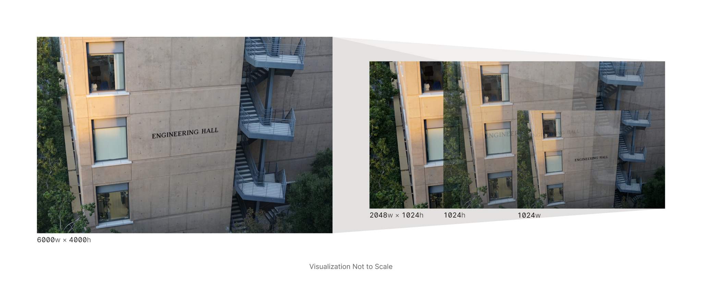

# image-resize-wasm



Resize images by width, height, or both using the [Rust Image crate](https://crates.io/crates/image) and [WASM](https://webassembly.org/).

This package uses [wasm-pack](https://rustwasm.github.io/wasm-pack/) as a build tool. The origin of this project was to use an Edge Function to resize images on the fly.

## Usage

### Vercel Edge Function

<https://vercel.com/docs/functions/edge-functions/wasm>

```ts
// api/index.ts
// http://localhost:3000/api?url=https://example.com/example.png&w=1024

// @ts-ignore
import wasm from "image-resize-wasm/image_resize_wasm_bg.wasm?module";
import init, {
  scale_by_width,
  scale_by_height,
  resize,
} from "image-resize-wasm";

export const config = {
  runtime: "edge",
};

export default async function handler(request: Request) {
  await init(wasm);
  const { searchParams } = new URL(request.url);
  const url = searchParams.get("url"),
    wString = searchParams.get("w"),
    hString = searchParams.get("h");

  if (!url || (!wString && !hString)) throw new Error();
  const w = Number(wString),
    h = Number(hString);

  const response = await fetch(url);
  const imageUint8Array = new Uint8Array(await response.arrayBuffer());

  let scaledImage;
  if (w && h) {
    scaledImage = resize(imageUint8Array, w, h);
  } else if (w) {
    scaledImage = scale_by_width(imageUint8Array, w);
  } else if (h) {
    scaledImage = scale_by_height(imageUint8Array, h);
  }

  return new Response(scaledImage, {
    status: 200,
    headers: {
      "Content-Type": "image/jpeg",
    },
  });
}
```

## Contributing

### Build

```bash
wasm-pack build --target web
```

## License

Copyright © 2023 Alexander Liu

MIT License
